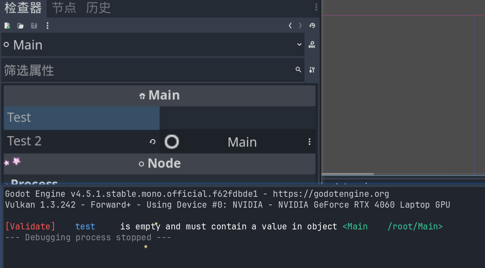

# GodotExportValidator

## 介绍

Godot 验证export的资源是否手动挂载，并提供提示信息。

## 下载

[release]() 下载nuget包

## 使用

1. 添加本地 NuGet 源 (文件夹)

dotnet nuget add source "H:\project\godot\GodotLocalPackages" --name GodotLocalPackages

把下载的nuget包放到本地nuget源文件夹下

2. godot项目配置
 
```xml

<ItemGroup>
    <PackageReference Include="GodotExportValidator.SourceGenerator" Version="1.0.0" />
</ItemGroup>

```
3. 重新编译项目

rider内编译可能会出现错误，请在godot编辑器内编译

## 示例


```gdscript
[Export] [Validate] private string test;

[Export] [Validate] public Node test2;

public override void _Notification(int what)
{
    base._Notification(what);
    if (what == NotificationEnterTree)
    {
        OnValidate();
    }
}
```




生成代码:

```csharp
// Main_Validate.generate.cs auto-generated by GodotExportValidator
using GodotExportValidator;
partial class Main
{
private void OnValidate()
{
ValidateUtilities.ValidateCheckEmptyString(this, "test", test);
ValidateUtilities.ValidateCheckNullValue(this, "test2", test2);
}
}

```
## 原理

* 源生成器生成OnValidate方法，在节点树进入树时调用，遍历所有导出属性，检查是否手动挂载，并提供提示信息。
* ValidateUtilities属于运行时代码，由Godot 编译的dll提供。
* nuget 打包项目包含Analyzer和lib文件夹，其中Analyzer属于源生成器，lib文件夹包含运行时代码。
* using导入的是 godot 编译的dll,暂时没有兼容性问题,项目打包后可以正常运行。


